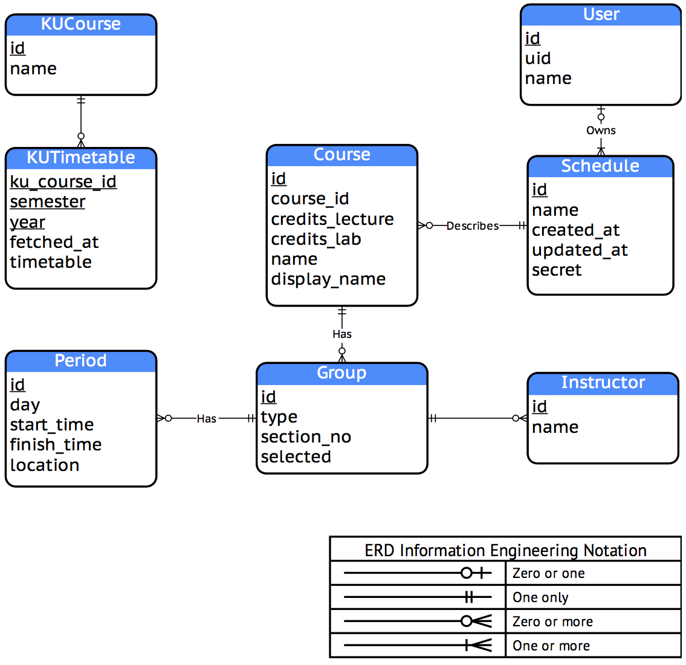

Background and Opportunity
==========================

Each semester,
we need to plan on which courses to register in the next semester.
This process is very cumbersome,
because we need to find the list of all the subjects we need to register,
then find the timetable for each of the sections that we can enroll,
not to mention that when finding the timetable,
we had to know the subject ID;
we can't search by the subject name.

After gathering all the raw data,
we have to plan the courses
by drawing a timetable ourselves,
in order to see whether any courses have overlapping schedule or not.
Some other times,
the course schedule for some course are changed,
and so the students need to update their timetables again.

This opens an opportunity for us to create a solution
for this problem—a study scheduling tool that will help alleviate all these problems.

Objectives and Goals
====================

Our goal is to create:

* an easy-to-use study schedule planning application
* for KU students, as well as students outside of KU
* that can be used in the real world, outside of this database course.

For the initial version,
our software will have the following characteristics:

* User can create their own study timetable.
* User can save the timetable. The timetable will be saved to the database.
* For KU students, they can import the timetable from the registration website.
* System can create interesting report (which data will be anonymous).

Benefits
========

The benefits are obvious: College students, especially KU students,
will be able to use this tool to

* create and share a study timetable; and
* plan their study schedule more effectively.

Software Tools
==============

| Tool | Purpose |
| ---- | ------- |
| draw.io | ER Diagramming |
| MySQL   | Database Management System |
| PHP     | Scripting language on the server |
| AngularJS | Client-side application framework |
| DomCrawler | Scraping the registration website's timetable |
| Facebook PHP SDK | User Authentication and Login with Facebook |

ER Diagram
==========

Development
===========

Data Dictionary
---------------

TBA

Example Queries
===============

